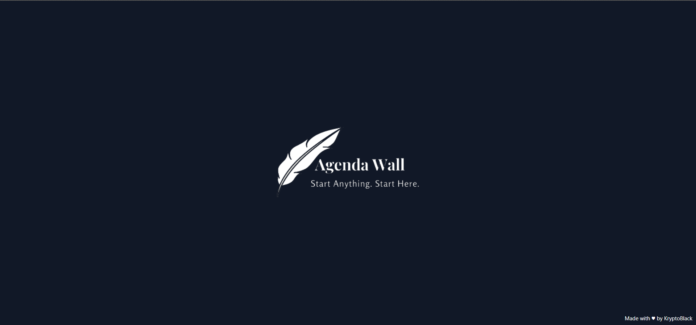
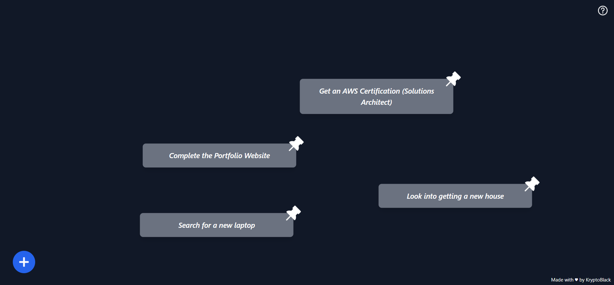
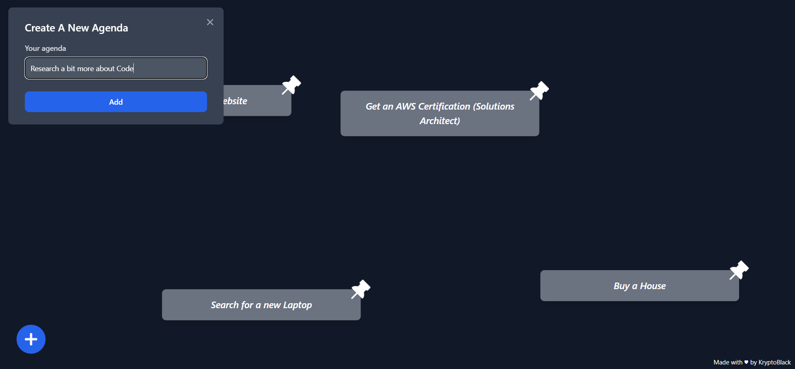
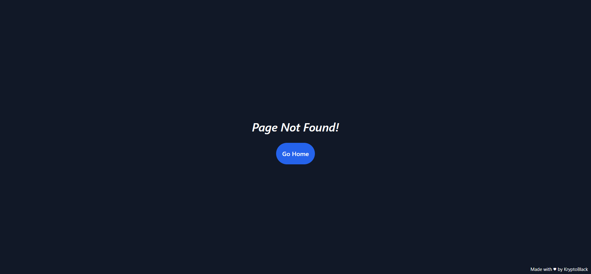

# AgendaWall

A simple wall of cards that can be used to display agenda items.

## Usage

Clone down this repository. You will need node and npm installed globally on your machine.

Installation:

`yarn install`

To Run Test Suite:

`yarn test`

To Start Server:

`yarn start`

To Visit App:

`http://localhost:3000`

To Build App:

`yarn build`

## Routes

### `/`

Simple page that users can see when they visit the app.

### `/wall`

The main page of the app. This is where the wall of cards is displayed.

You can add cards to the wall by clicking the "+" button.

### `/404`

The page that is displayed when a user tries to visit a page that doesn't exist.

There is a button that will take the user to the home page.

## Problems Faced

1. Difficulty in understanding the assignment instructions. Whether I had to use AWS Development Services or whether I am free to choose in how to build the CI/CD Pipeline.
2. Difficulty in deciding which service to use (CodeBuild or CodePipeline)
3. Faced Issue in creating the CI/CD Pipeline (As it was my first time using AWS CodeBuild). I had issues in uploading my artifact to the root of the S3 bucket.

### Additional Problems Faced
1. Wasn't able to decide on a design for the app.
2. Difficulty in using tailwindcss (As it was my first time using it).

## Future Improvements
- Unlimited canvas size
- Phone support
- Card can have priorities
- Make it PWA!

## Inspiration
Excalidraw and MY WALL.

## Note
**I am sorry for the notification mess. If you wanna know how I would solve it.**

**CodeBuild -> lambda (formatter) -> SNS (Email) -> Subscribers** 